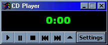

## Leet CD Player

### Description

A simple CD Player yet it is very LEET for beginners. Has all standard CD Player features. PLease vote for my pathetic code.
 
### More Info
 

             |
---                |---
**Submitted On**   |2001-04-02 20:20:42
**By**             |[Alan Walker](https://github.com/Planet-Source-Code/PSCIndex/blob/master/ByAuthor/alan-walker.md)
**Level**          |Beginner
**User Rating**    |3.7 (11 globes from 3 users)
**Compatibility**  |VB 5\.0, VB 6\.0
**Category**       |[Sound/MP3](https://github.com/Planet-Source-Code/PSCIndex/blob/master/ByCategory/sound-mp3__1-45.md)
**World**          |[Visual Basic](https://github.com/Planet-Source-Code/PSCIndex/blob/master/ByWorld/visual-basic.md)
**Archive File**   |[Leet CD Pl187554232001\.zip](https://github.com/Planet-Source-Code/alan-walker-leet-cd-player__1-22645/archive/master.zip)

